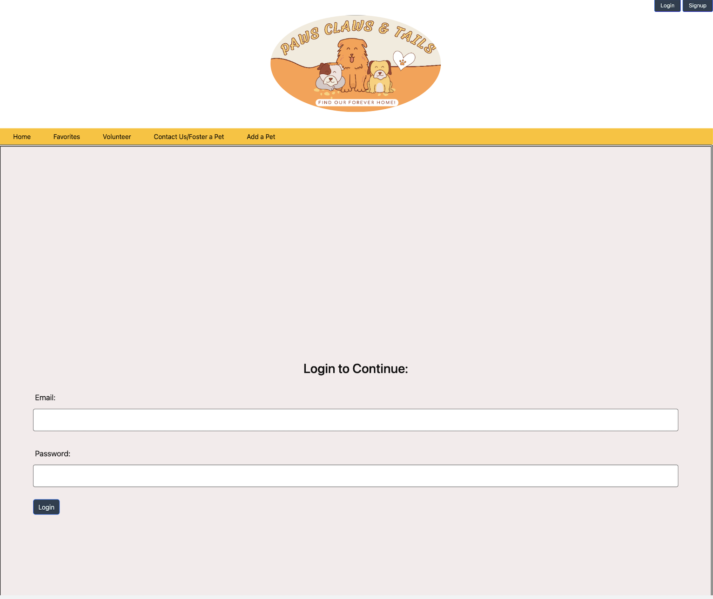
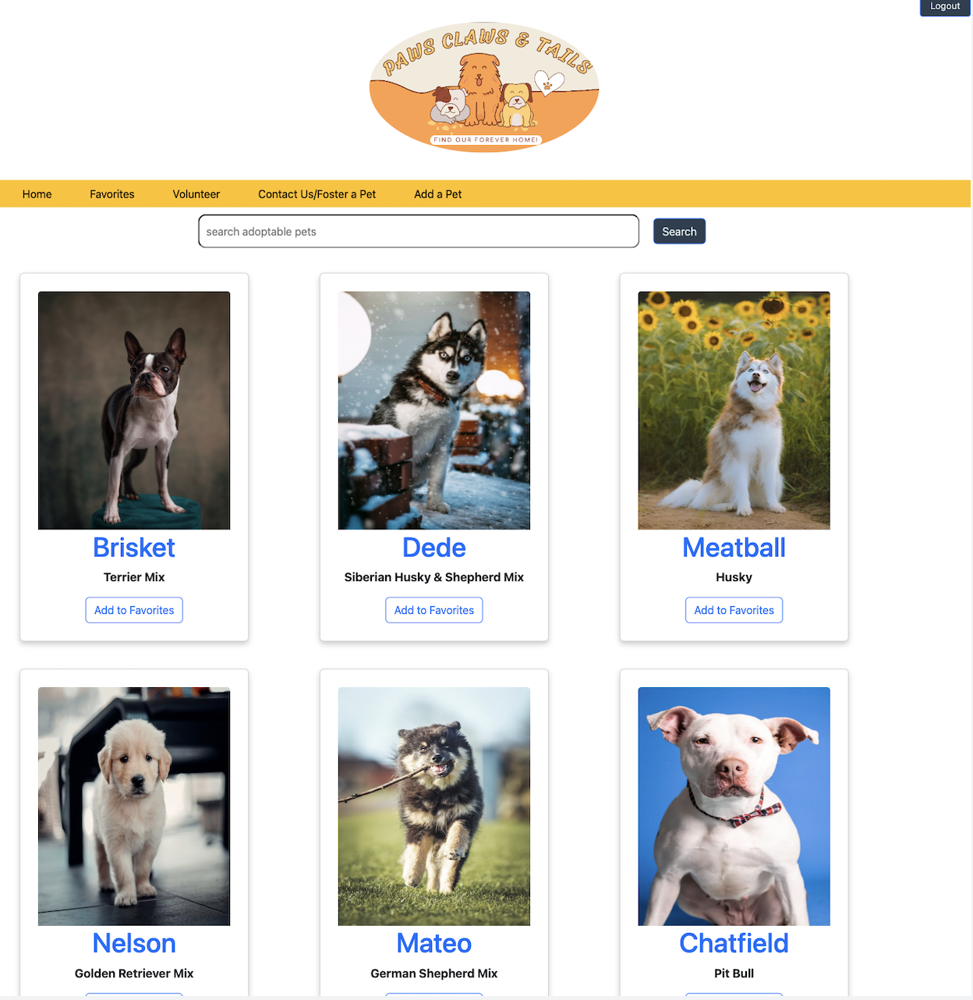
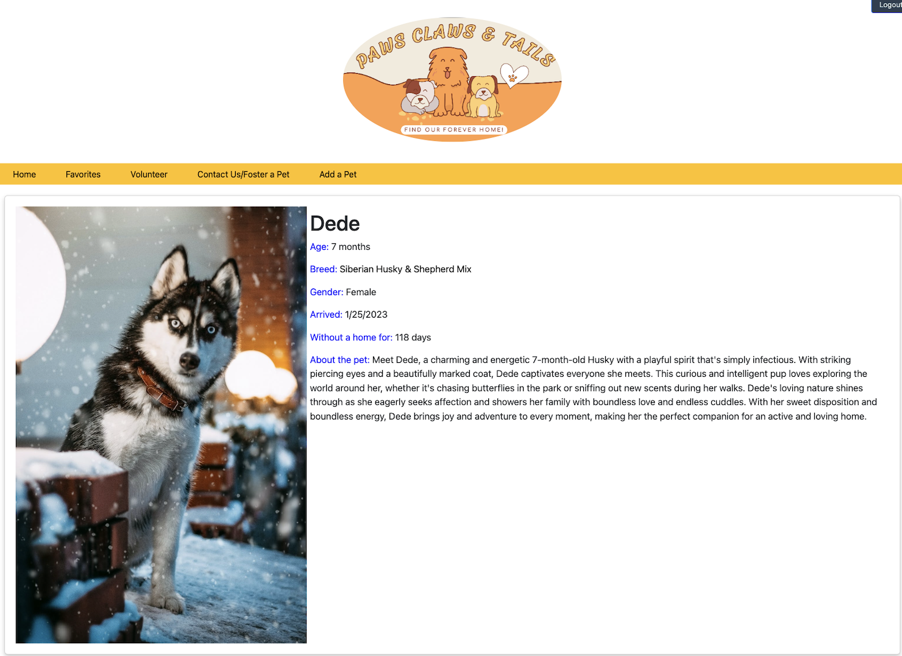

# Group-3-Project-2

Pet adoption app that displays all available pets for adoption. User can generate favorites through button click. 
Users can volunteer at the shelter using fullcalendar. Contact us form. Add a new pet functionality. 
Foster tab for form to volunteer for foster care.
Technologies used Node JS, Express JS.,
Handlebars, Bootstrap, Bcrypt, cookie parser, fullcalendar,       
mysql2, sequelize, dotenv.
Contributors: James Pierce, Abel Zemo, Valerie, Guerra, Sophia Perez, Cameron Oberlies
github link: https://github.com/cameronoberlies/Group-3-Project-2.git
contact james59222@gmail.com for any questions or concerns.
Testing done through self testing and debugging using console.
Heroku: https://paws-claws-and-tails.herokuapp.com/home
